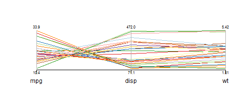
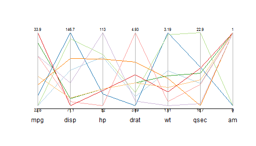

# Investigating Variable Effects on MPG

## Utilizing Parallel Coordinate Graphs

### By: Steve Rowe

--- .class #id 

## Parallel Coordinate Graphs

* Way of visualizing multivariate data
* Used as early as 1880 by Henry Gannetts in *General Summary, Showing the Rank of States, by Ratios*
* More useful when used interactively, as in this [application](https://thornkin.shinyapps.io/dataproducts):

 

---

## Using Parallel Coordinates With MPG
The [application](https://thornkin.shinyapps.io/dataproducts) allows two axes of control:
* Selecting Variables
 * Used to see relationships more clearly
* Limiting MPG range
  * Used to see which variables are related to ranges.
  * For instance, what kind of cylinders are in high MPG cars?

---
## Selecting Variables
* Variables can be removed by unchecking the variables boxes.
 * Sometimes relationships can become more clear by limiting the variables.
* For example, only displacement and weight looks like this:

 
* It is clear that displacement is inversely correlated with high MPG.  Weight is highly correlated with displacement.

---

## Utilizing the MPG Range
* The MPG range can be limited to see what variables affect a high MPG cars.
* Limiting the range to >= 22 MPG generates this graph:
 
* Most high MPG cars have low displacement, low weight, are slow, and are manual transmissions.
